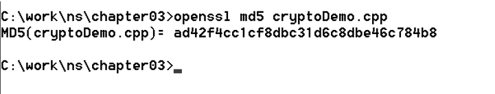
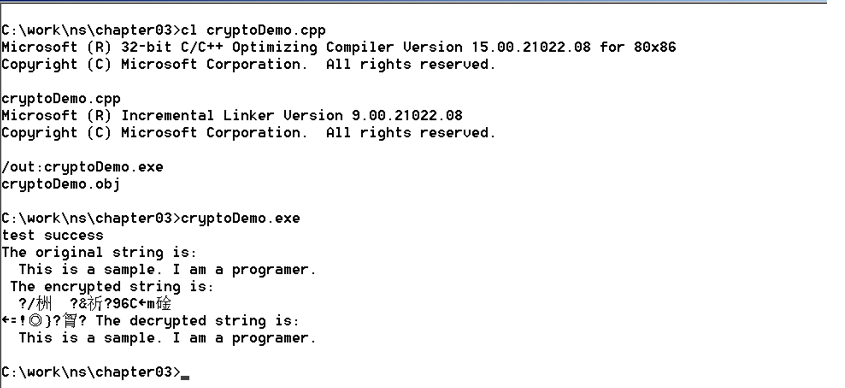
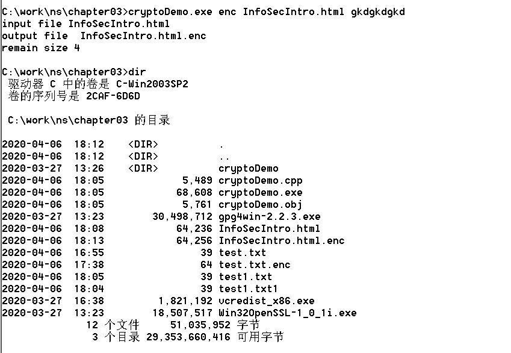
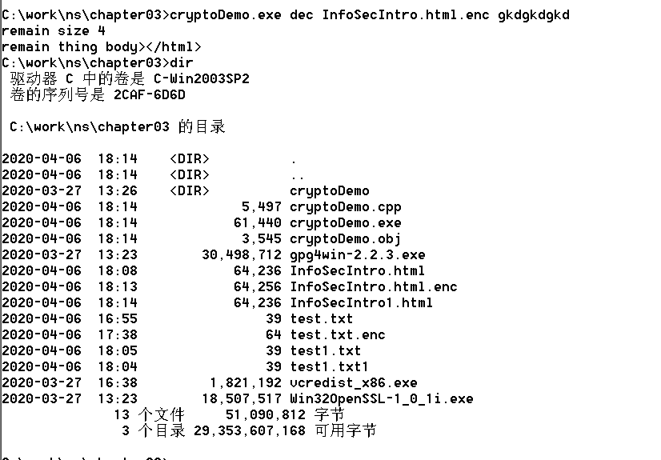

# 信息安全导论第二次实验报告

+ 焦培淇 &nbsp; &nbsp; PB17151767

## 实验目的

1. 掌握 OpenSSL 的命令；
2. 掌握在 C 程序中使用 OpenSSL 的方法； 
3. 掌握 PGP 的使用。

## 实验内容

1. 使用 OpenSSL 的常用命令； 
2. 利用 OpenSSL 编程实现 RSA 加密、解密； 
3. 用 PGP 实现加密和解密。

## 实验步骤

### 准备工作

将虚拟机的网络连接方式设置为“网络地址转换(NAT)”模式，启动虚拟机，设置本地网卡为自动获取 IP 地址模式，使虚拟机可以访问因特网。新建目录C:\work\ns\chapter03，从课程网站下载 cryptoDemo.zip，Win32Openssl 和 gpg4Win 到目录 C:\work\ns\chapter03，并将文件解压缩。

### 使用OpenSSL的常用命令

点击安装Win32OpenSSL-1_0_1i，并加入环境变量；将C:\OpenSSL-Win32下的 include 和 lib 目录拷贝到 C:\Program Files\Microsoft Visual Studio 9.0\VC 中。

利用openssl计算文件md5值如下：

### 利用openssl编程实现AES的加密，解密

1. 编译运行cryptoDemo.cpp

将cryptoDemo.cpp程序的第 10 行代码改成 #include "openssl\aes.h"，启动 Visual Studio 2008 Command Prompt 编译环境，编译和运行，结果如下：

2. 修改例程cryptoDemo.cpp

修改后的程序从命令行接受3个字符串类型的参数：参数1，参数2，参数3。参数1=enc表示加密，参数1=dec表示解密；参数2为待加密、解密的文件名；参数3为密码。

修改如下：

+ 首先接受命令行参数，根据参数的第一个字母（e表示enc即加密，d表示dec即解密）来进行不同的过程。

+ 在加密过程中，首先将密码扩展为256位，设置加密密码；创建输出文件，名字为输入文件名加后缀.enc；然后每次从输入文件读取16字节，调用aes的加密函数，进行加密，并写入输出文件中；循环读取并加密后，不够16字节的部分填充0进行加密并写入；最后将填充的0的个数存储在多余的一个16字节里面，进行加密后放置在输出文件的末尾。

+ 在解密过程中，首先将密码扩展为256位，设置解密密码；创建输出文件，名字为输入文件名（带.enc后缀）去掉后缀.enc（即原始加密前的文件名），并在文件名后加1表示区分；然后每次从输入文件读取16字节，调用aes的解密函数，进行解密，并写入输出文件中；循环读取并解密后，在倒数第二个16字节时（即源文件的最后一个块），读取最后16个字节，解码得到添加的0的个数，将0去掉并写入输出文件；程序结束。

3. 正确性验证

首先进行加密，产生InfoSecIntro.html.enc加密文件

再进行解密，生成InfoSecIntro1.html文件

通过FC命令比较两个文件可见，文件无差异，程序正确。

4. 附件操作

附件为加密后的文件，密码为gkdgkdgkd，编译程序后输入命令cryptoDemo.exe dec InfoSecIntro.html.enc gkdgkdgkd 后即可得到解密文件InfoSecIntro1.html，与源文件比较可知程序正确。