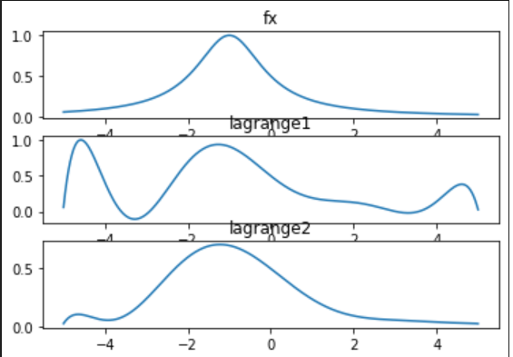

# 计算方法实验二报告
+ 姓名：焦培淇 &nbsp; &nbsp; 学号：PB17151767

## 计算结果
1. 第一组节点, 误差为
+ n=4 , 0.500332873931
+ n=8 , 0.933022609178
+ n=16 , 4.036628088374

2. 第二组节点, 误差为
+ n=4 , 0.518475585615
+ n=8 , 0.302302926257
+ n=16 , 0.036833691833

3. 函数图像：
+ n=4 

+ n=8 

+ n=16 

## 算法分析
&nbsp; &nbsp; 首先定义两个python函数，接受参数为n和x，分别计算第一组节点在给定的n和x下的值和第二组节点在给定的n和x下的值。函数的内部通过for循环，生成用于插值的点列和对应的函数值，再通过课上所讲的拉格朗日插值算法，计算给定x下的函数值。然后通过列表生成用于估计误差的点列x1。最后，依次调用上述两函数，计算在n=4,n=8,n=16情况下x1点列中的对应函数值并和原函数值做差取最大作为误差

&nbsp; &nbsp; 在画图方面，通过调用python的matplotlib库，对三个函数（两个插值函数和一个原函数）取一系列均匀点来绘制图像。

&nbsp; &nbsp; 最终得到的误差和函数图像如上所示。

## 结果分析
1. 从两个方法在不同插值点个数时的结果比较来看

+ 对于均匀节点这个插值函数。首先，从最大误差计算结果可见随着插值函数次数的升高，插值函数与原函数在插值区间内的最大误差逐渐增大；同时随着插值次数的升高，插值函数在区间内与原函数图像接近重合的范围更大，而插值函数在区间端点附近的波动也越来越大，即产生了所谓的Runge现象，这导致了最大误差越来越大。所以在用均匀选取插值节点方式构造好插值函数后，为了减小误差，最好选择底次的插值函数，因为此时插值函数与原函数最吻合。

+ 对于Chebyshev节点这一个插值函数。首先，从最大误差计算结果可见随着插值函数次数的升高，插值函数与原函数在插值区间内的最大误差逐渐减小；同时随着插值次数的升高，插值函数在区间内与原函数图像接近重合的范围更大，而且插值函数在区间端点附近的波动也越来越小或者相差不大，从而最大误差越来越小。所以在用Chebyshev节点方式构造好插值函数后，为了减小误差，应该选择高次的插值函数，因为此时插值函数与原函数最吻合。

2. 在同一插值次数从两种方法分别生成的插值函数比较来看

+ 对比同一插值次数的两个插值函数的最大误差计算结果，可以看出插值次数相等时，Chebyshev点插值函数的最大误差比均匀点插值函数的误差小，而且随着插值次数的增加Chebyshev点插值函数的最大误差与均匀点插值函数的最大误差比值也在减小，但是当N=4时，两种插值函数的最大误差相差不大，甚至均匀点插值函数的最大误差还要更小一点。

+ 对比函数图像，可以看出插值次数相等时，Chebyshev点插值函数的图像比均匀点插值函数的图像更贴近原函数图像，而且随插值次数升高两个插值函数的图像的波动次数都有所增加，但是Chebyshev点插值函数图像的波动幅度会随之减小，因此与原函数的图像重合程度也就增加，而均匀点插值函数图像的最大波动幅度确随着N值增加而急剧增加，因此与原函数的图像在部分区域偏差很大。但是同时也可以看出在区间的中间区域，均匀点插值函数图像的重合度更高。

## 实验结论
&nbsp; &nbsp; 从这个实验中我们可以看到，对于拉格朗日插值算法，并不是随着插值节点的增多，插值的效果便会更好。对于等距高次插值来说，由于Runge现象的存在，其数值稳定性较差，本身是病态的。虽然均匀点插值函数图像在区间中间区域与原函数的重合度稍高一些，不过在这一点上与Chebyshev点插值函数相差并不大。因此如果我们想获得更好的插值效果，在增加插值节点的个数的同时，需要采用非等距的节点来进行插值，比如上述的Chebyshev点列；或者进行分段插值来提高插值的精确度。

