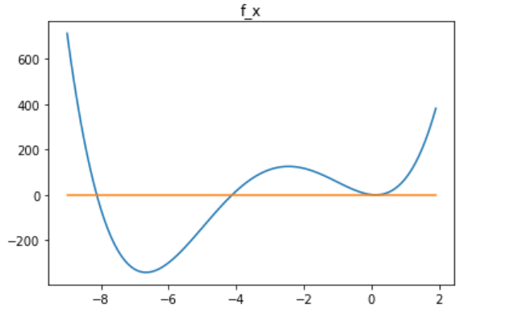

# 计算方法第三次实验报告

+ 焦培淇 &nbsp; &nbsp; PB17151767

## 实验结果

### newton法迭代结果

#### x0=0

| 迭代步数k | x_k | f(x_k) |
| --- | --- | --- |
| k=0 | 0 | 1.00000000000000 |
| k=1 | 0.0625000000000000 | 0.244171142578125 |
| k=2 | 0.0926751448225923 | 0.0603578217099111 |
| k=3 | 0.107509160229866 | 0.0149947601516366 |
| k=4 | 0.114853233763046 | 0.00372488987478090 |
| k=5 | 0.118483681521745 | 0.000916260643363105 |
| k=6 | 0.120242606774498 | 0.000215772688018643 |
| k=7 | 0.121025817898753 | 4.28476818522506e-5 |
| k=8 | 0.121283832705868 | 4.65309593603593e-6 |
| k=9 | 0.121319626673357 | 8.95690627919956e-8 |
| k=10 | 0.121320343272189 | 3.59006050408256e-11 |

#### x0=3

| 迭代步数k | x_k | f(x_k) |
| --- | --- | --- |
| k=0 | 3 | 1312.00000000000 |
| k=1 | 1.91927512355848 | 391.807290765145 |
| k=2 | 1.19361332277328 | 113.682625657871 |
| k=3 | 0.731121454583345 | 31.8598761821473 |
| k=4 | 0.453620806086133 | 8.61905044161285 |
| k=5 | 0.296636931415324 | 2.26334711606154 |
| k=6 | 0.211975351119953 | 0.581974266533479 |
| k=7 | 0.167794035309137 | 0.147707094601209 |
| k=8 | 0.145194388790635 | 0.0372063342275401 |
| k=9 | 0.133767607310272 | 0.00932536798595917 |
| k=10 | 0.128036497039886 | 0.00232226382071177 |
| k=11 | 0.125196033266053 | 0.000567554171232354 |
| k=12 | 0.123838722420784 | 0.000129270496952984 |
| k=13 | 0.123271028946865 | 2.25871027440014e-5 |
| k=14 | 0.123118562606628 | 1.62847547113787e-6 |
| k=15 | 0.123105718084746 | 1.15563298949680e-8 |
| k=16 | 0.123105625622452 | 5.98837436817152e-13 |

### 弦截法迭代结果

#### x0=0,x1=0.5

| 迭代步数k | x_k | f(x_k) |
| --- | --- | --- |
| k=0 | 0 | 1.00000000000000 |
| k=1 | 0.5 | 11.3750000000000 |
| k=2 | -0.0481927710843374 | 1.91008394502621 |
| k=3 | -0.158821772413660 | 4.98495832982336 |
| k=4 | 0.0205289563261179 | 0.697452415319068 |
| k=5 | 0.0497040995079915 | 0.358394015065135 |
| k=6 | 0.0805430248884595 | 0.119653607310420 |
| k=7 | 0.0959990957817496 | 0.0475828042596896 |
| k=8 | 0.106203549802078 | 0.0177778476021120 |
| k=9 | 0.112290229629208 | 0.00681021835821673 |
| k=10 | 0.116069680755565 | 0.00257957842147367 |
| k=11 | 0.118374152588748 | 0.000974152656910191 |
| k=12 | 0.119772477823475 | 0.000360723560109005 |
| k=13 | 0.120594755181187 | 0.000127417414359160 |
| k=14 | 0.121043832313163 | 3.98787671678793e-5 |
| k=15 | 0.121248412152595 | 9.34535702751283e-6 |
| k=16 | 0.121311027878494 | 1.16951812859142e-6 |
| k=17 | 0.121319984785238 | 4.48169374316117e-8 |
| k=18 | 0.121320341698819 | 2.32401655589725e-10 |

#### x0=0.1,x1=1.5

| 迭代步数k | x_k | f(x_k) |
| --- | --- | --- |
| k=0 | 0.1 | 0.0342000000000000 |
| k=1 | 1.5 | 205.375000000000 |
| k=2 | 0.0997668266608489 | 0.0349200227286260 |
| k=3 | 0.0995287037661671 | 0.0356629946822271 |
| k=4 | 0.110958711972524 | 0.00877228307565304 |
| k=5 | 0.114687407181865 | 0.00389693929419953 |
| k=6 | 0.117667812160207 | 0.00138764519547540 |
| k=7 | 0.119315982715771 | 0.000530994531709867 |
| k=8 | 0.120337600499248 | 0.000190232319219920 |
| k=9 | 0.120907924065605 | 6.33972801149782e-5 |
| k=10 | 0.121192994840587 | 1.70385505523192e-5 |
| k=11 | 0.121297768911325 | 2.85501351704791e-6 |
| k=12 | 0.121318858953072 | 1.85569099543362e-7 |
| k=13 | 0.121320325048425 | 2.31192104124664e-9 |
| k=14 | 0.121320343544272 | 1.91968798692766e-12 |

### f_x函数图像

同时我们利用计算机求解方程可得，该方程共有四个根如下：

化简为小数形式如下：

可以看出上述迭代方法在对应初值下的结果均为存在的根。

## 结果分析

从上述实验结果可以看出newton迭代算法的收敛速度比弦截法迭代算法的收敛速度要快，但是同时也可以看出newton迭代算法对于初始值的要求较高，当初始值选取不佳时，迭代次数会大大增加。

## 实验结论

当我们使用牛顿迭代法求根时，要特别注意初始值的选择，尽量使初始值靠近我们想要求得的根，否则迭代次数将会较多。而当我们需要使用一个收敛速度比较快又无须计算导数的的迭代公式时，应当采用弦截法。